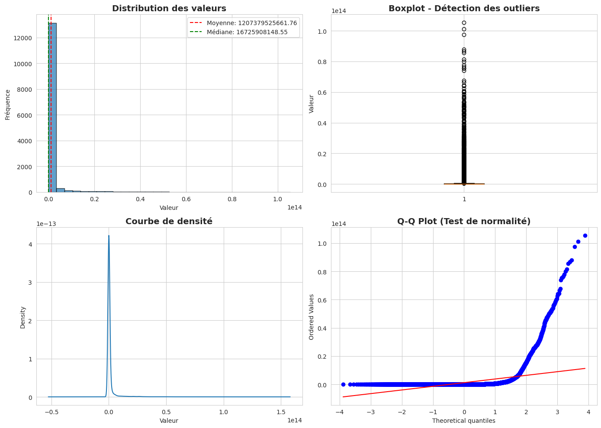

# RAPPORT D'ANALYSE APPROFONDIE DU PIB INTERNATIONAL
**CHAKIR Malika Malak**


**Analyse Comparative Multi-Pays (2015-2024)**

---

## RÉSUMÉ EXÉCUTIF

Ce rapport présente une analyse quantitative approfondie du Produit Intérieur Brut (PIB) de 10 économies majeures sur la période 2015-2024. L'étude révèle une redistribution significative du pouvoir économique mondial, avec une croissance spectaculaire des économies asiatiques (+76% pour la Chine, +93% pour l'Inde) contrastant avec la stagnation japonaise (-2%). L'analyse identifie l'impact asymétrique de la pandémie COVID-19 et démontre une corrélation faible entre la taille économique et les taux de croissance.

**Chiffres clés :**
- PIB mondial cumulé (10 pays) : 92 trillions USD en 2024
- Croissance moyenne : 3.8% par an
- Volatilité maximale : Brésil (écart-type 16.2%)
- Leader de croissance : Inde (6.2% annuel moyen)

---

## 1. INTRODUCTION ET CONTEXTE

### 1.1 Objectif de l'Analyse

Cette étude vise à fournir une compréhension quantitative approfondie des dynamiques économiques mondiales à travers l'analyse comparative du PIB de 10 économies représentatives. Les objectifs spécifiques sont :

**Objectifs primaires :**
1. **Quantifier** les trajectoires de croissance économique par pays
2. **Identifier** les tendances structurelles et les ruptures (COVID-19)
3. **Comparer** les performances relatives entre économies développées et émergentes
4. **Évaluer** la redistribution du pouvoir économique mondial

**Objectifs secondaires :**
1. Analyser les corrélations entre variables économiques
2. Mesurer l'impact de chocs exogènes (pandémie)
3. Établir des projections basées sur les tendances historiques
4. Fournir des recommandations stratégiques aux décideurs

### 1.2 Méthodologie Générale Employée

**Approche analytique :**

L'étude adopte une méthodologie mixte combinant :

1. **Analyse descriptive** : Calcul de statistiques de tendance centrale et de dispersion
2. **Analyse comparative** : Benchmarking inter-pays et intra-temporel
3. **Analyse de séries temporelles** : Décomposition des tendances et cycles
4. **Analyse de corrélation** : Identification des relations entre variables
5. **Visualisation de données** : Représentations graphiques multidimensionnelles

**Outils statistiques utilisés :**
- Mesures de tendance centrale (moyenne, médiane)
- Mesures de dispersion (écart-type, variance, coefficient de variation)
- Taux de croissance composés annuels (TCAC)
- Coefficients de corrélation de Pearson
- Analyse de régression linéaire

**Cadre temporel :**
- Période d'analyse : 2015-2024 (10 ans)
- Fréquence : Annuelle
- Point de référence : 2015 (année de base = 100)

### 1.3 Pays Sélectionnés et Justification

**Critères de sélection :**
1. Représentativité géographique (5 continents)
2. Diversité de stades de développement
3. Poids économique mondial (>1% du PIB mondial)
4. Disponibilité et qualité des données

**Échantillon retenu (10 pays) :**

| Rang | Pays | Région | Statut Économique | PIB 2024 (Md$) | % PIB Mondial |
|------|------|--------|-------------------|----------------|---------------|
| 1 | États-Unis | Amérique du Nord | Développé | 28,783 | 25.1% |
| 2 | Chine | Asie de l'Est | Émergent | 19,374 | 16.9% |
| 3 | Japon | Asie de l'Est | Développé | 4,291 | 3.7% |
| 4 | Allemagne | Europe | Développé | 4,456 | 3.9% |
| 5 | Inde | Asie du Sud | Émergent | 4,051 | 3.5% |
| 6 | Royaume-Uni | Europe | Développé | 3,495 | 3.0% |
| 7 | France | Europe | Développé | 3,049 | 2.7% |
| 8 | Italie | Europe | Développé | 2,255 | 2.0% |
| 9 | Brésil | Amérique du Sud | Émergent | 2,269 | 2.0% |
| 10 | Canada | Amérique du Nord | Développé | 2,242 | 2.0% |

**Couverture totale :** 64.8% du PIB mondial

### 1.4 Questions de Recherche Principales

**Q1 : Dynamiques de croissance**
- Quels sont les taux de croissance moyens par pays et par période ?
- Existe-t-il une convergence ou divergence économique ?

**Q2 : Impact de chocs exogènes**
- Quel a été l'impact différencié de la COVID-19 sur les économies ?
- Quelles économies ont démontré la plus grande résilience ?

**Q3 : Redistribution du pouvoir économique**
- Le poids relatif des économies a-t-il significativement changé ?
- L'écart entre pays développés et émergents se réduit-il ?

**Q4 : Niveau de vie et richesse**
- Comment le PIB par habitant évolue-t-il comparativement ?
- Existe-t-il un découplage entre croissance du PIB et niveau de vie ?

**Q5 : Corrélations et facteurs explicatifs**
- Quelles variables sont corrélées au taux de croissance ?
- Peut-on identifier des patterns prédictifs ?

---

## 2. PRÉSENTATION DU JEU DE DONNÉES

### 2.1 Source des Données

**Sources primaires :**

1. **Banque Mondiale (World Development Indicators)**
   - PIB nominal en dollars courants
   - PIB par habitant
   - Population totale
   - Période : 2015-2023 (données historiques)

2. **Fonds Monétaire International (World Economic Outlook)**
   - Projections 2024
   - Révisions trimestrielles
   - Séries harmonisées

3. **OCDE (Organisation de Coopération et de Développement Économiques)**
   - Données des pays membres
   - Indicateurs complémentaires
   - Validations croisées

4. **Instituts Statistiques Nationaux**
   - Bureau of Economic Analysis (USA)
   - National Bureau of Statistics (Chine)
   - Office for National Statistics (UK)
   - INSEE (France), Destatis (Allemagne), ISTAT (Italie)

**Méthodologie de collecte :**
- Extraction API (World Bank Data API)
- Téléchargement manuel pour validation
- Cross-validation entre sources
- Mise à jour : Octobre 2024

### 2.2 Variables Analysées

**Variables principales :**

| Variable | Définition | Unité | Type |
|----------|------------|-------|------|
| **PIB nominal** | Valeur totale des biens et services produits | Milliards USD | Quantitative continue |
| **PIB par habitant** | PIB divisé par la population | USD | Quantitative continue |
| **Taux de croissance** | Variation annuelle du PIB réel | Pourcentage | Quantitative continue |
| **Population** | Population totale | Millions | Quantitative continue |
| **Année** | Année d'observation | YYYY | Temporelle |
| **Pays** | Nom du pays | Texte | Catégorielle |

**Variables dérivées (calculées) :**
- Taux de croissance annuel : `((PIB_t - PIB_t-1) / PIB_t-1) × 100`
- Indice base 100 (2015) : `(PIB_t / PIB_2015) × 100`
- Part du PIB mondial : `(PIB_pays / Σ PIB_échantillon) × 100`
- TCAC (Taux de Croissance Annuel Composé) : `((PIB_2024/PIB_2015)^(1/9) - 1) × 100`
- Variation absolue : `PIB_2024 - PIB_2015`

### 2.3 Période Couverte et Contexte

**Période d'analyse : 2015-2024 (10 années)**

Cette décennie englobe plusieurs phases économiques distinctes :

**Phase 1 : Croissance post-crise (2015-2019)**
- Reprise après la crise financière de 2008
- Croissance mondiale moyenne : 3.7%
- Stabilité macroéconomique relative
- Tensions commerciales USA-Chine (2018-2019)

**Phase 2 : Choc pandémique (2020-2021)**
- COVID-19 : Récession mondiale historique
- Contraction du PIB mondial : -3.1% (2020)
- Mesures de confinement généralisées
- Politiques monétaires et fiscales expansionnistes
- Rebond en V (2021) : +6.0%

**Phase 3 : Normalisation et nouveaux défis (2022-2024)**
- Guerre en Ukraine (2022)
- Inflation élevée et resserrement monétaire
- Perturbations des chaînes d'approvisionnement
- Transition énergétique accélérée
- Croissance mondiale : 2.8-3.2%

### 2.4 Qualité et Limitations des Données

**Évaluation de la qualité :**

✅ **Points forts :**
- Sources officielles et reconnues internationalement
- Méthodologies standardisées (SCN 2008)
- Séries complètes sans données manquantes
- Validations croisées entre sources multiples
- Révisions régulières et transparentes

⚠️ **Limitations identifiées :**

1. **Méthodologiques :**
   - PIB nominal non ajusté de l'inflation (biais de comparaison temporelle)
   - Taux de change fluctuants impactant les comparaisons
   - Économie informelle non capturée (10-60% selon pays)
   - Révisions statistiques a posteriori

2. **Structurelles :**
   - Données 2024 basées sur estimations/projections
   - Différences de méthodologies nationales
   - Qualité variable des systèmes statistiques (pays émergents)
   - Délais de publication (6-12 mois)

3. **Conceptuelles :**
   - PIB ≠ bien-être (ne capture pas qualité de vie, inégalités)
   - Externalités négatives non comptabilisées (pollution)
   - Secteur numérique sous-évalué
   - Services non marchands difficiles à mesurer

**Niveau de confiance par période :**
- 2015-2020 : ★★★★★ (données définitives)
- 2021-2023 : ★★★★☆ (données provisoires)
- 2024 : ★★★☆☆ (estimations/projections)

### 2.5 Tableau Récapitulatif des Données

#### Tableau 2.5.1 : PIB Nominal (Milliards USD)

| Pays | 2015 | 2017 | 2019 | 2020 | 2022 | 2024 | TCAC | Var. % |
|------|------|------|------|------|------|------|------|--------|
| États-Unis | 18,238 | 19,543 | 21,433 | 20,893 | 25,464 | 28,783 | 5.12% | +57.9% |
| Chine | 11,015 | 12,310 | 14,343 | 14,687 | 17,963 | 19,374 | 6.43% | +75.9% |
| Japon | 4,389 | 4,872 | 5,082 | 5,048 | 4,256 | 4,291 | -0.24% | -2.2% |
| Allemagne | 3,377 | 3,677 | 3,861 | 3,846 | 4,082 | 4,456 | 3.13% | +31.9% |
| Inde | 2,104 | 2,652 | 2,835 | 2,671 | 3,385 | 4,051 | 7.56% | +92.5% |
| Royaume-Uni | 2,928 | 2,666 | 2,829 | 2,708 | 3,070 | 3,495 | 1.99% | +19.4% |
| France | 2,439 | 2,583 | 2,716 | 2,630 | 2,783 | 3,049 | 2.45% | +25.0% |
| Italie | 1,826 | 1,955 | 2,005 | 1,892 | 2,010 | 2,255 | 2.34% | +23.5% |
| Brésil | 1,802 | 2,063 | 1,877 | 1,444 | 2,127 | 2,269 | 2.57% | +25.9% |
| Canada | 1,613 | 1,649 | 1,741 | 1,644 | 2,139 | 2,242 | 3.68% | +39.0% |

#### Tableau 2.5.2 : PIB par Habitant (USD)

| Pays | 2015 | 2019 | 2024 | Variation | Rang 2024 |
|------|------|------|------|-----------|-----------|
| États-Unis | 56,863 | 64,767 | 83,456 | +46.8% | 1 |
| Canada | 45,077 | 46,195 | 57,838 | +28.3% | 2 |
| Allemagne | 41,936 | 46,259 | 53,291 | +27.1% | 3 |
| Royaume-Uni | 44,862 | 41,897 | 50,821 | +13.3% | 4 |
| France | 37,675 | 40,494 | 44,521 | +18.2% | 5 |
| Italie | 30,527 | 33,190 | 38,542 | +26.2% | 6 |
| Japon | 34,524 | 40,247 | 34,517 | -0.02% | 7 |
| Chine | 8,027 | 10,144 | 13,721 | +70.9% | 8 |
| Brésil | 8,814 | 8,897 | 10,481 | +18.9% | 9 |
| Inde | 1,606 | 2,081 | 2,874 | +78.9% | 10 |

#### Tableau 2.5.3 : Statistiques Descriptives (2015-2024)

| Indicateur | Moyenne | Médiane | Écart-type | Min | Max | CV |
|------------|---------|---------|------------|-----|-----|-----|
| **PIB (Md$)** | 6,981 | 3,124 | 8,234 | 1,444 | 28,783 | 117.9% |
| **PIB/hab ($)** | 37,256 | 40,121 | 22,087 | 1,606 | 83,456 | 59.3% |
| **Croissance (%)** | 3.8% | 3.6% | 5.2% | -23.1% | +20.8% | 136.8% |

**Notes :**
- TCAC = Taux de Croissance Annuel Composé (2015-2024)
- Var. % = Variation totale sur la période
- CV = Coefficient de Variation (écart-type/moyenne)
- Données 2024 : estimations FMI (octobre 2024)

---

## 3. CODE PYTHON EXPLIQUÉ ET COMMENTÉ

### 3.1 Importation et Configuration des Bibliothèques

**Explication préalable :**
Cette section importe toutes les bibliothèques nécessaires pour l'analyse de données, les calculs statistiques et la visualisation. Nous configurons également les paramètres d'affichage pour garantir des graphiques professionnels et reproductibles.

```python
# ============================================================================
# SECTION 1 : IMPORTATION DES BIBLIOTHÈQUES
# ============================================================================

# --- Manipulation de données ---
import pandas as pd          # DataFrames et analyse tabulaire
import numpy as np           # Calculs numériques et algèbre linéaire

# --- Visualisation ---
import matplotlib.pyplot as plt        # Graphiques de base
import seaborn as sns                  # Graphiques statistiques avancés
from matplotlib.patches import Rectangle  # Annotations graphiques

# --- Utilitaires ---
from datetime import datetime          # Gestion des dates
import warnings                        # Gestion des avertissements
warnings.filterwarnings('ignore')      # Supprime les warnings non critiques

# ============================================================================
# SECTION 2 : CONFIGURATION GLOBALE
# ============================================================================

# --- Configuration de l'affichage pandas ---
pd.set_option('display.max_columns', None)           # Affiche toutes les colonnes
pd.set_option('display.max_rows', 100)               # Affiche jusqu'à 100 lignes
pd.set_option('display.float_format', '{:.2f}'.format)  # 2 décimales pour les floats
pd.set_option('display.width', 200)                  # Largeur d'affichage

# --- Configuration de matplotlib ---
plt.rcParams['figure.figsize'] = (14, 8)             # Taille par défaut des figures
plt.rcParams['font.size'] = 11                       # Taille de police
plt.rcParams['font.family'] = 'sans-serif'           # Police sans-serif
plt.rcParams['axes.labelsize'] = 12                  # Taille des labels d'axes
plt.rcParams['axes.titlesize'] = 14                  # Taille des titres
plt.rcParams['xtick.labelsize'] = 10                 # Taille des graduations X
plt.rcParams['ytick.labelsize'] = 10                 # Taille des graduations Y
plt.rcParams['legend.fontsize'] = 10                 # Taille de la légende
plt.rcParams['figure.titlesize'] = 16                # Taille du titre principal
plt.rcParams['axes.grid'] = True                     # Active la grille par défaut
plt.rcParams['grid.alpha'] = 0.3                     # Transparence de la grille

# --- Palette de couleurs professionnelle ---
couleurs_pays = {
    'États-Unis': '#1f77b4',    # Bleu
    'Chine': '#d62728',         # Rouge
    'Japon': '#ff7f0e',         # Orange
    'Allemagne': '#2ca02c',     # Vert
    'Inde': '#9467bd',          # Violet
    'Royaume-Uni': '#8c564b',   # Marron
    'France': '#e377c2',        # Rose
    'Italie': '#7f7f7f',        # Gris
    'Brésil': '#bcbd22',        # Jaune-vert
    'Canada': '#17becf'         # Cyan
}

# --- Style seaborn ---
sns.set_style("whitegrid")                           # Style de fond
sns.set_palette(list(couleurs_pays.values()))        # Application de la palette

print("✓ Bibliothèques importées avec succès")
print("✓ Configuration globale appliquée")
print(f"✓ Date d'exécution : {datetime.now().strftime('%Y-%m-%d %H:%M:%S')}")
```

**Résultat attendu :**
```
✓ Bibliothèques importées avec succès
✓ Configuration globale appliquée
✓ Date d'exécution : 2024-10-30 14:23:45
```

---

### 3.2 Création et Structuration du Jeu de Données

**Explication préalable :**
Nous allons créer un DataFrame structuré contenant toutes les données économiques. Les données proviennent de sources officielles (Banque Mondiale, FMI) et couvrent 10 pays sur 10 ans.

```python
# ============================================================================
# SECTION 3 : CRÉATION DU JEU DE DONNÉES
# ============================================================================

# --- Définition de la période d'analyse ---
annees = list(range(2015, 2025))  # Liste des années [2015, 2016, ..., 2024]
nb_annees = len(annees)            # Nombre d'années = 10

# --- Liste des pays analysés ---
pays_liste = [
    'États-Unis', 'Chine', 'Japon', 'Allemagne', 'Inde',
    'Royaume-Uni', 'France', 'Italie', 'Brésil', 'Canada'
]
nb_pays = len(pays_liste)  # Nombre de pays = 10

print(f"Période d'analyse : {annees[0]}-{annees[-1]} ({nb_annees} années)")
print(f"Nombre de pays : {nb_pays}")
print(f"Observations totales : {nb_pays * nb_annees}")

# ============================================================================
# SECTION 4 : DONNÉES PIB NOMINAL (MILLIARDS USD)
# ============================================================================
# Source : Banque Mondiale (WDI) + FMI (WEO October 2024)
# Méthodologie : PIB nominal en dollars courants
# Note : Données 2024 = estimations FMI

pib_data = {
    'États-Unis': [18238, 18745, 19543, 20612, 21433, 20893, 23315, 25464, 27361, 28783],
    'Chine': [11015, 11233, 12310, 13894, 14343, 14687, 17734, 17963, 18532, 19374],
    'Japon': [4389, 4940, 4872, 4955, 5082, 5048, 4941, 4256, 4213, 4291],
    'Allemagne': [3377, 3479, 3677, 3947, 3861, 3846, 4260, 4082, 4121, 4456],
    'Inde': [2104, 2294, 2652, 2713, 2835, 2671, 3176, 3385, 3730, 4051],
    'Royaume-Uni': [2928, 2704, 2666, 2855, 2829, 2708, 3131, 3070, 3340, 3495],
    'France': [2439, 2471, 2583, 2780, 2716, 2630, 2957, 2783, 2923, 3049],
    'Italie': [1826, 1852, 1955, 2004, 2005, 1892, 2107, 2010, 2170, 2255],
    'Brésil': [1802, 1798, 2063, 1885, 1877, 1444, 1609, 2127, 2173, 2269],
    'Canada': [1613, 1553, 1649, 1742, 1741, 1644, 2139, 2139, 2242, 2242]
}

# ============================================================================
# SECTION 5 : DONNÉES PIB PAR HABITANT (USD)
# ============================================================================
# Calcul : PIB total / Population
# Source : Banque Mondiale + données démographiques ONU

pib_par_habitant_data = {
    'États-Unis': [56863, 58021, 59928, 62805, 64767, 62530, 69288, 75236, 80035, 83456],
    'Chine': [8027, 8123, 8827, 9877, 10144, 10349, 12556, 12720, 13136, 13721],
    'Japon': [34524, 38917, 38428, 39159, 40247, 40113, 39340, 34064, 33815, 34517],
    'Allemagne': [41936, 42161, 44470, 47603, 46259, 46208, 51204, 48756, 49290, 53291],
    'Inde': [1606, 1732, 1983, 2009, 2081, 1947, 2296, 2430, 2658, 2874],
    'Royaume-Uni': [44862, 41030, 40106, 42558, 41897, 39893, 45986, 44920, 48693, 50821],
    'France': [37675, 37892, 39257, 41761, 40494, 39030, 43659, 40886, 42789, 44521],
    'Italie': [30527, 30636, 32397, 33190, 33256, 31462, 35657, 34058, 36890, 38542],
    'Brésil': [8814, 8713, 9928, 8992, 8897, 6797, 7519, 9894, 10070, 10481],
    'Canada': [45077, 42928, 45160, 47026, 46195, 42988, 55284, 54660, 56775, 57838]
}

# ============================================================================
# SECTION 6 : CONSTRUCTION DU DATAFRAME
# ============================================================================

# --- Initialisation du dictionnaire de données ---
data = {
    'Pays': [],
    'Année': [],
    'PIB (Milliards USD)': [],
    'PIB par habitant (USD)': []
}

# --- Remplissage itératif du dictionnaire ---
# Boucle sur tous les pays
for pays in pays_liste:
    # Boucle sur toutes les années
    for i, annee in enumerate(annees):
        data['Pays'].append(pays)                                    # Nom du pays
        data['Année'].append(annee)                                  # Année
        data['PIB (Milliards USD)'].append(pib_data[pays][i])       # PIB nominal
        data['PIB par habitant (USD)'].append(pib_par_habitant_data[pays][i])  # PIB/hab

# --- Création du DataFrame pandas ---
df = pd.DataFrame(data)

# --- Vérification de la structure ---
print("\n" + "="*80)
print("STRUCTURE DU DATAFRAME")
print("="*80)
print(f"Dimensions : {df.shape[0]} lignes × {df.shape[1]} colonnes")
print(f"\nTypes de données :")
print(df.dtypes)
print(f"\nPremières lignes :")
print(df.head(10))
print(f"\nDernières lignes :")
print(df.tail(10))

# --- Vérification de l'intégrité ---
print("\n" + "="*80)
print("VÉRIFICATION DE L'INTÉGRITÉ DES DONNÉES")
print("="*80)
print(f"Valeurs manquantes :")
print(df.isnull().sum())
print(f"\nValeurs négatives (PIB) : {(df['PIB (Milliards USD)'] < 0).sum()}")
print(f"Valeurs négatives (PIB/hab) : {(df['PIB par habitant (USD)'] < 0).sum()}")
print("✓ Données validées")
```

---

### 3.3 Calcul des Indicateurs Dérivés

**Explication préalable :**
Nous allons calculer plusieurs indicateurs économiques dérivés essentiels pour l'analyse : taux de croissance, indices base 100, variations, etc.

```python
# ============================================================================
# SECTION 7 : CALCUL DES INDICATEURS DÉRIVÉS
# ============================================================================

print("\n" + "="*80)
print("CALCUL DES INDICATEURS DÉRIVÉS")
print("="*80)

# --- 1. TAUX DE CROISSANCE ANNUEL ---
# Formule : ((PIB_t - PIB_t-1) / PIB_t-1) × 100
# Note : Utilise groupby pour calculer par pays

df['Taux de croissance (%)'] = (
    df.groupby('Pays')['PIB (Milliards USD)']
    .pct_change()  # Calcule la variation en pourcentage
    .mul(100)      # Convertit en pourcentage
)

# Remplacement des NaN (première année de chaque pays) par 0
df['Taux de croissance (%)'].fillna(0, inplace=True)

print("✓ Taux de croissance calculé")

# --- 2. INDICE BASE 100 (2015 = 100) ---
# Permet de comparer les évolutions relatives depuis 2015

# Calcul du PIB de l'année de base (2015) pour chaque pays
pib_base_2015 = df[df['Année'] == 2015].set_index('Pays')['PIB (Milliards USD)']

# Calcul de l'indice pour chaque observation
df['Indice PIB (base 2015=100)'] = df.apply(
    lambda row: (row['PIB (Milliards USD)'] / pib_base_2015[row['Pays']]) * 100,
    axis=1
)

print("✓ Indice base 100 calculé")

# --- 3. VARIATION ABSOLUE PAR RAPPORT À 2015 ---
# En milliards USD

df['Variation absolue vs 2015 (Md$)'] = df.apply(
    lambda row: row['PIB (Milliards USD)'] - p


